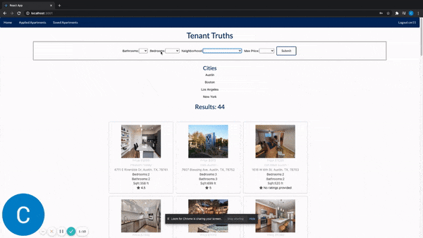

### TenantTruths
Back-end for TenantTruths, an app inspired by StreetEasy & Yelp. TenantTruths is designed to provide prospective rentors with more transparency on the apartments they are interested in. Built with a React front end and Ruby on Rails back end. Styling was done with Semantic UI and Custom CSS.

[Website](https://tenanttruths.netlify.app/) / [Demo](https://www.loom.com/share/c999bfbd86124f1f8ea8418b6e252fa2)

[Front-End](https://github.com/cmur11/apartmentreviewfrontend/blob/main/README.md)
To start the server:

bundle install 
rails db:create && rails db:migrate 
rails s  
